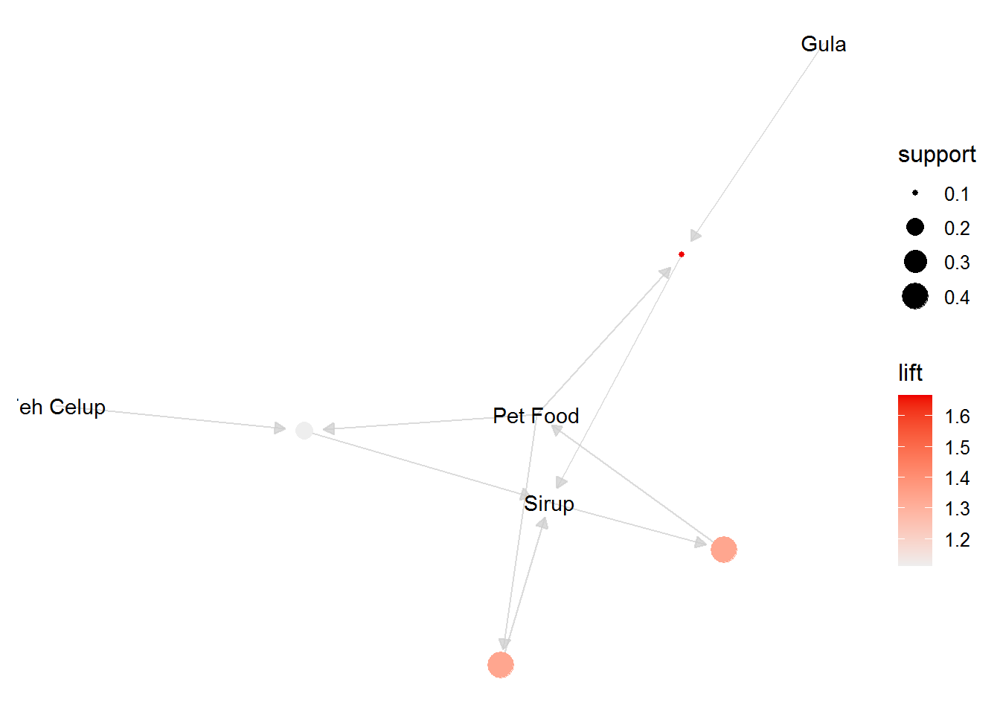
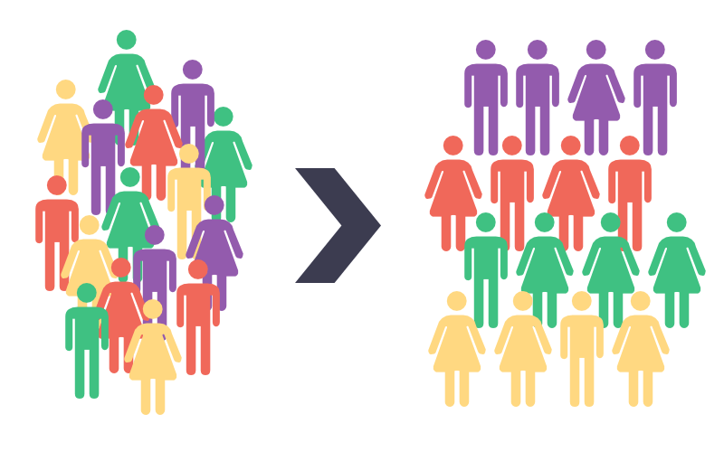
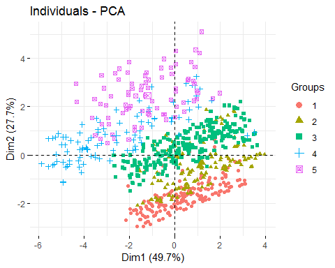
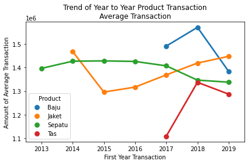
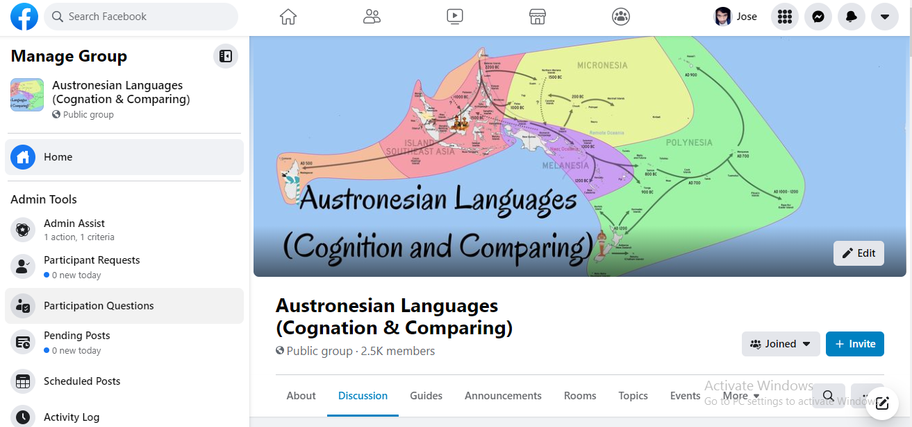

<b>Portfolio</b>

---
## Data Science in Industry
These are my Data Science rehearsals.

### Data Science in Finance: Credit Risk Analysis

 Credit Risk Analysis is a technique to find the value of loan risk that can be certified by the borrowers. In this technique, a risk assessment process is usually carried out before a loan is given, which is called credit scoring and credit rating to the borrowers.

The benefit of this credit scoring is that it minimizes the risk that can occur to the borrowing institution, which based on the results of this assessment will determine whether the loan application is accepted or rejected by the financial institution.

To calculate this credit risk, financial institutions usually use a predetermined standard calculation. However, what is increasingly becoming a trend is calculations using machine learning methods based on historical loan data. The application of machine learning methods in R using a decision tree algorithm called C5.0.

---
### Data Science in Retail: Market Basket Analysis

In retail, technological innovation is the automated analysis of thousands to millions of transaction data to find combinations of frequently purchased products together. From various case studies, this combined information can be used to increase sales by 18% to 60%. Besides being effective for increasing sales, this information can also be used to solve stock problems.

This analysis process is known as Market Basket Analysis (MBA). And in the world of data science, a popular algorithm to support this process is Apriori.

---
### Data Science in Marketing: Customer Segmentation

All businesses or business entities must have customers. Customers have specific characteristics, for example age 36 years and female. Actually, these characteristics can be further divided in more detail by profession, for example housewives and career women. And it is still further divided in more detail based on total spending for a year, province of residence, and others.

The more you recognize customer characteristics, the easier it will be to innovate products with the needs of these characters and conduct marketing communications. This process of dividing customer characteristics is called Customer segmentation. If this process is carried out on customer data manually, it will be difficult and time consuming, especially with large amounts and variations of data.

Fortunately, there are currently many automation processes for customer segmentation using various machine learning algorithms. Two of them are k-means and k-modes. Data Science in Marketing: Customer Segmentation focuses on understanding and using these two algorithms with a practical approach using the R programming language.

---
### Data Science in Finance: Dimension Reduction

The C5.0 decision tree algorithm can predict a customer's credit scoring or rating. I classify credit scoring or rating accurately by using Principal Component Analysis statistical techniques. In this section, I use the C5.0 decision tree algorithm to predict the credit scoring or rating of a customer.

The data processing method and the prediction results use machine learning techniques to produce models that can be implemented in the financial sector later.

---
### Machine Learning: Customer Churn Prediction

I did Machine Learning Modelling for DQlab Telco customers churn using dataset from June 2020. The steps to be taken are Performing Exploratory Data Analysis, Doing Data Pre-Processing, Doing Machine Learning Modeling, and Determining the Best Model.

The algorithms tested are Logistic Regression, Random Forest Classifier, and Gradient Boosting Classifier

 

 

---
### Data Analytics: Business Decision Research

DQLab Sport Center is a store that sells various sports needs such as jackets, clothes, bags, and shoes. The shop has been selling since 2013, so it has had regular customers for a long time, and is still trying to get new customers to this day. In early 2019, the store manager hired a junior Data Analyst to help solve the problem in his store, namely the decline in customers who buy back to his store. The Junior Data Analyst was also entrusted with processing the store's transaction data. The store manager defines that a customer is no longer called a customer (churn) when he has not transacted to his store again up to the last 6 months from the last available data update.

So, the store manager and junior Data Analyst at one of the branches asked me to help out with their market research with the data and issues. It's good that while I'm working, I make my work report step by step so that the data analysis process can be known to solve this case.

 

 

---
## Community: Austronesian Languages

Besides Data Science, I also have a great passion for linguistics. Some friend and I manage a Facebook group, Austronesian Languages (Cognation & Comparing). Our group is online community for Austronesian speakers and enthusiasts to share knowledges about Austronesian languages.

 

 
---

© 2020 Khanh Tran. Powered by Jekyll and the Minimal Theme.

