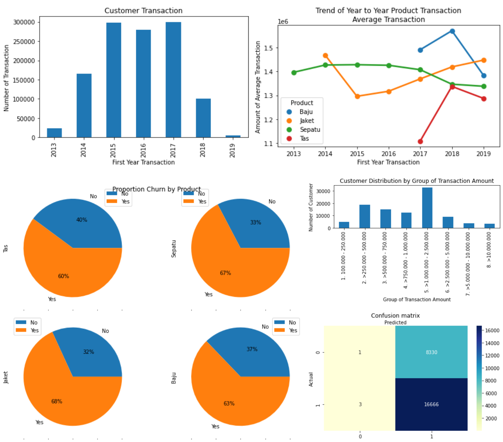

<b>Portfolio</b>

---

## Data Science in Finance: Credit Risk Analysis

In this project, I was asked to analyze the credit customer dataset from DQLab and built a model for the dataset. The analysis I did was to look at the relationship between the variables and the risk_rating to find the risk tendency. The variables were going to be used for modelling. The model used was a decision tree algorithm from the C50 library.

The goal of this project is to use a decision tree algorithm to find rules, classify classes of credit customers, and apply models to new data.

---

## Data Science in Retail: Market Basket Analysis

Market Basket Analysis (MBA) is an analysis technique used by retail businesses to find strong product associations, or in other words find product packages that can have a major impact on sales.

In this project, I was asked to analyze the combination of DQLab Retail transaction products using the a priori algorithm. The purpose of this analysis is to obtain the association rule dataset.

---
## Data Science in Marketing: Customer Segmentation

In this project, I had customer segmentation with R. The algorithm used in this project is the k-means algorithm. The several steps I had before implementing the algorithm were preparing the data, normalizing the <i>NilaiBelanjaSetahun</i> column, selecting the variables to be used, and finding the optimal cluster for k-means.

The ultimate goal of this project is to find customer clusters and name them according to characteristics of the clusters.

---

## Data Science in Finance: Dimension Reduction

In this reduction dimension, I learned about the theory of principal component analysis and exercises its application to credit scoring. Principal component analysis is a technique used to reduce the number of unnecessary variables as input to the algorithm without compromising the quality of the prediction.

In the practice, the several subject matters I did were data standardization, the correlation matrix, eigenvalues, and eigenvectors calculation, selection of the number of principal components, and data visualization.

---
## Machine Learning: Customer Churn Prediction

I did Machine Learning Modelling for DQlab Telco customers churn using dataset from June 2020. The steps to be taken are Performing Exploratory Data Analysis, Doing Data Pre-Processing, Doing Machine Learning Modeling, and Determining the Best Model.

The algorithms tested are Logistic Regression, Random Forest Classifier, and Gradient Boosting Classifier

 

 

---

## Data Analytics: Business Decision Research

The store manager and junior Data Analyst of DQLab Sport Center asked me to help out with their market research with the data and issues. While I was working, I created my work report step by step so that the data analysis process could be known to solve this case.

I wanted to have a churn analysis of products in one of the branches. My goal was to provide recommendations and strategies to reduce customer churn.

 

 

---

## Data Visualization: Jakarta Bus Passengers in 2017

I did a data visualization of Jakarta bus passenger data in 2017 by the Jakarta government to see the statistics.

What I wanted to see is the comparison between the number of bus passengers and the buses in operation, the average growth in the number of bus passengers during the year, and the number of buses operating in certain months.

 

 

---

## Community: Austronesian Languages

Besides Data Science, I also have a great passion for linguistics. Some friend and I manage a Facebook group, Austronesian Languages (Cognation & Comparing). Our group is online community for Austronesian speakers and enthusiasts to share knowledges about Austronesian languages.

 

 

---
